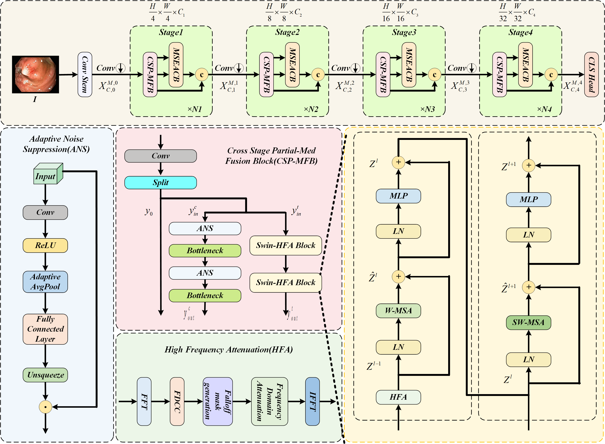
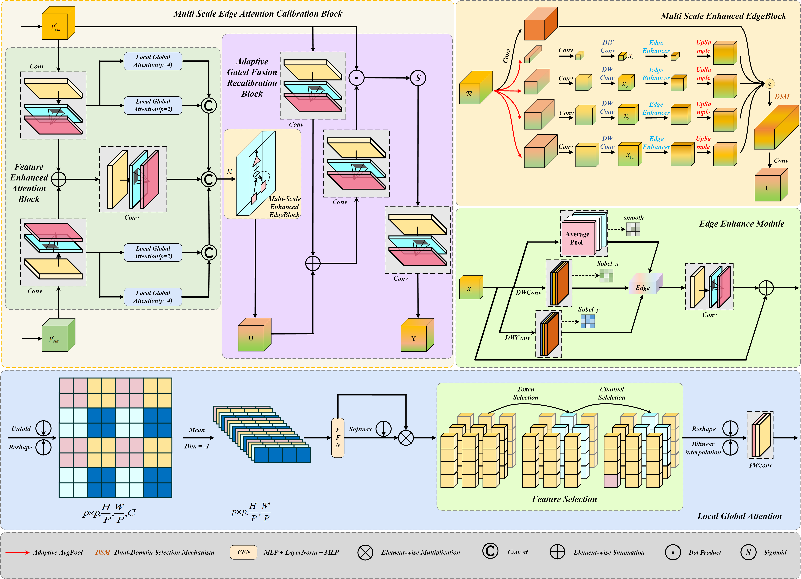

# EdgeMAF-Net: Edge-guided Multi-scale Attention Fusion Network for Gastrointestinal Tumor Image Classification

[](https://www.python.org/downloads/)
[](https://pytorch.org/)
[](LICENSE)

> **Official Implementation** of EdgeMAF-Net for medical image classification tasks, specifically designed for gastrointestinal cancer detection.

---

## 🌟 Abstract

Automated classification of gastrointestinal (GI) tumor images is a pivotal technology in computer-aided diagnostic systems, demonstrating significant potential for enhancing early screening efficiency and supporting clinical decision-making. However, medical images are often affected by high-frequency noise due to limitations of acquisition devices and intrinsic tissue characteristics. In addition, lesion regions frequently exhibit blurred edges and low contrast, posing challenges for accurate extraction of discriminative features. Suppressing noise while enhancing fine-grained features is therefore essential for this task. To address these challenges, we propose a novel Edge-guided Multi-scale Attention Fusion Network (EdgeMAF-Net) for precise GI tumor image classification. Specifically, we introduce a cross stage partial fusion module that dynamically allocates features to both CNN and Transformer branches, enabling simultaneous modeling of local details and global context. This is complemented by a high-frequency attenuation and noise suppression mechanism, as well as a Multi-scale Edge Attention Calibration Module (MSEACM), which integrates a three-stage enhancement strategy to capture features at different scales and delineate blurred boundaries. The module leverages a Feature Enhancement Attention Block (FEAB) to weight multi-source features, combined with a Multi-scale Edge Enhancement Block (MSEEB) employing multi-scale pooling and edge extraction, and an Adaptive Gated Fusion Block (AGFB) to dynamically adjust feature fusion. We evaluate EdgeMAF Net on the Chaoyang, Kvasir, and GasHisSDB datasets. The results show that EdgeMAF-Net achieves an accuracy of 86.72%, sensitivity of 94.8%, and area under the ROC curve (AUC) of 95.31% on Chaoyang; 94.9% accuracy and 94.7% sensitivity on Kvasir; and 98.1% accuracy with high sensitivity for small lesions (80×80 images) on GasHisSDB. Overall, EdgeMAF-Net outperforms existing methods in terms of accuracy, sensitivity, and boundary localization, highlighting its broad potential for application in GI disease diagnosis. The EdgeMAF-Net code is available at https://github.com/Bambi-lab/EdgeMAF-Net

---

## 🏛️ Architecture

### Network Structure





## 📊 Dataset

### Gastrointestinal Cancer Dataset

The dataset consists of endoscopic images from **5 disease categories**:

| Category                                        | Train         | Val          | Test | Total |
| ----------------------------------------------- | ------------- | ------------ | ---- | ----- |
| Esophageal cancer                               | 182           | 23           | 23   | 228   |
| Gastric cancer                                  | 162           | 20           | 20   | 202   |
| Gastric mucosal cancer                          | 30            | 4            | 4    | 38    |
| High-grade esophageal intraepithelial neoplasia | 13            | 2            | 2    | 17    |
| High-grade gastric intraepithelial neoplasia    | 19            | 2            | 2    | 23    |
| **Total**                                 | **406** | **51** | 51   | 508   |

### Dataset Structure

```
dataset/
├── train/
│   ├── Esophageal cancer/
│   ├── Gastric cancer/
│   ├── Gastric mucosal cancer/
│   ├── High-grade esophageal intraepithelial neoplasia/
│   └── High-grade gastric intraepithelial neoplasia/
├── val/
│   └── [same structure as train]
└── test/
    └── [same structure as train]
```

---

## 🔧 Installation

### Prerequisites

- Python 3.8 or higher
- CUDA 11.0+ (for GPU training)
- 8GB+ GPU memory recommended

### Step 1: Clone the Repository

```bash
git clone https://github.com/Bambi-lab/EdgeMAF-Net.git
cd EdgeMAF-Netv2
```

### Step 2: Create Virtual Environment (Optional but Recommended)

```bash
# Using conda
conda create -n edgemaf python=3.8
conda activate edgemaf

# Or using venv
python -m venv edgemaf_env
source edgemaf_env/bin/activate  
```

### Step 3: Install Dependencies

```bash
pip install -e .
```

Or install manually:

```bash
pip install torch>=1.8.0 torchvision>=0.9.0
pip install matplotlib>=3.3.0 opencv-python>=4.6.0 pillow>=7.1.2
pip install pyyaml>=5.3.1 tqdm>=4.64.0 pandas>=1.1.4 seaborn>=0.11.0
pip install scipy>=1.4.1 psutil thop>=0.1.1
```

---

## 🚀 Quick Start

### Prepare Your Dataset

1. Organize your images in the following structure:

```
dataset/
├── train/
│   ├── class1/
│   ├── class2/
│   └── ...
├── val/
│   └── [same structure]
└── test/
    └── [same structure]
```

2. Update the data path in `train.py` and `val.py` to point to your dataset location.

---

## 🎓 Training

### Basic Training

```bash
python train.py
```

### Training Configuration

Edit `train.py` to customize training parameters:

```python
model = EdgeMAF('ultralytics/cfg/models/EdgeMAF-Net.yaml')
model.train(
    data='dataset',  # Dataset path
    imgsz=224,                     # Input image size
    epochs=200,                    # Number of training epochs
    batch=64,                      # Batch size (adjust based on GPU memory)
    optimizer='SGD',               # Optimizer: SGD, Adam, AdamW
    patience=50,                   # Early stopping patience
    workers=0,                     # Data loading workers (0 for Windows)
    close_mosaic=0,                # Disable mosaic augmentation
    project='runs/EdgeMAF-Net',    # Save directory
    name='test',                    # Experiment name
    pretrained=False,              # Use pretrained weights
)
```

### Training Tips

1. **GPU Memory Issues**: Reduce batch size if encountering OOM errors

   ```python
   batch=32  # or 16, 8
   ```
2. **Data Augmentation**: Enable advanced augmentation for small datasets

   ```python
   augment=True
   hsv_h=0.015
   hsv_s=0.7
   hsv_v=0.4
   ```
3. **Class Imbalance**: The framework automatically handles class weights

### Monitor Training

Training logs and checkpoints are saved in:

```
runs/EdgeMAF-Net/exp/
├── weights/
│   ├── best.pt      # Best model checkpoint
│   └── last.pt      # Last epoch checkpoint
├── results.png      # Training curves
├── confusion_matrix.png
└── args.yaml        # Training arguments
```

---

## ✅ Validation

### Validate Trained Model

```bash
python val.py
```

### Validation Configuration

Edit `val.py` to specify the model and data:

```python
model = EdgeMAF('runs/EdgeMAF-Net/test/weights/best.pt')
metrics = model.val(
    data='dataset',
    imgsz=224,
    batch=64,
    split='val',              # 'val', 'test', or 'train'
    plots=True,               # Generate visualization plots
    save_json=True,           # Save results in JSON format
    project='runs/EdgeMAF-Net',
    name='val_test',
)
```

### Evaluation Metrics

The validation script reports the following metrics:

- **Accuracy**: Overall classification accuracy
- **Precision**: Macro-averaged precision (positive predictive value)
- **Recall**: Macro-averaged recall (sensitivity/true positive rate)
- **F1-Score**: Harmonic mean of precision and recall
- **Specificity**: Macro-averaged specificity (true negative rate)
- **Fitness**: Overall model performance metric `(Accuracy + F1-Score) / 2`

### Example Output

```
==================================================
           验证结果 (Validation Results)
==================================================
准确率 (Accuracy):      0.9250
精确率 (Precision):     0.9180
召回率 (Recall):        0.9100
F1分数 (F1-Score):      0.9140
特异性 (Specificity):   0.9780
综合性能 (Fitness):     0.9195
==================================================
```

### Validation Outputs

Results are saved in:

```
runs/EdgeMAF-Net/val_exp/
├── confusion_matrix.png          # Confusion matrix visualization
├── confusion_matrix_normalized.png
├── results.json                  # Detailed metrics in JSON
├── val_batch0_labels.jpg         # Ground truth labels
└── val_batch0_pred.jpg           # Model predictions
```

## 🔬 Advanced Usage

### Export Model

Export trained model to different formats:

```python
from edgemaf import EdgeMAF

model = EdgeMAF('runs/EdgeMAF-Net/exp/weights/best.pt')

# Export to ONNX
model.export(format='onnx', imgsz=224)

# Export to TensorRT
model.export(format='engine', imgsz=224)

# Export to CoreML (macOS)
model.export(format='coreml', imgsz=224)
```

---
